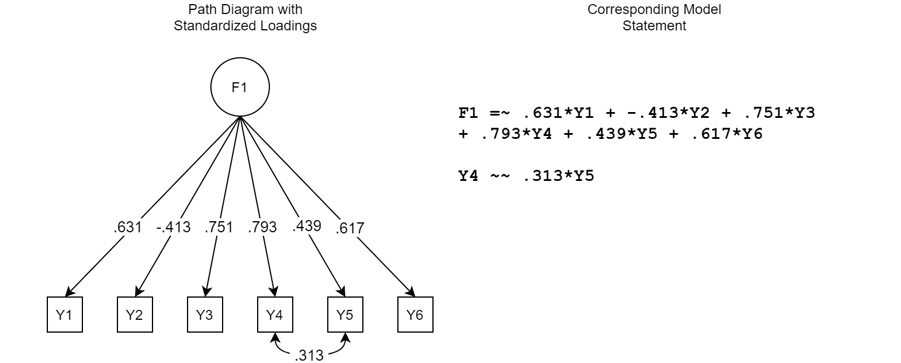

```{r setup, include=FALSE}
knitr::opts_chunk$set(echo = FALSE)
library(rmarkdown)
library(lavaan)
library(tidyverse)
library(simstandard)
library(shiny)
library(shinythemes)
library(flexdashboard)
library(knitr)
library(tools)
library(patchwork)
library(shinybusy)
library(purrr)
library(stringr)
#library(lemon)
#library(shinycssloaders)

#List aesthetics first
```

<style type="text/css">

body {
  font-family: Palatino;
}

.shiny-output-error-validation {
        color: #ff0000;
      }

</style>

<!-- Search Engine Optimization -->
<html>
<head>
<title>Dynamic Fit Index Cutoffs for CFA Models</title>

<meta name="description" content="Derive dynamic fit index cutoffs that are adaptively tailored to the specific factor model and data being evaluated."/>
</head>
</html>

<!-- Global site tag (gtag.js) - Google Analytics -->
<script async src="https://www.googletagmanager.com/gtag/js?id=UA-167733193-2"></script>
<script>
  window.dataLayer = window.dataLayer || [];
  function gtag(){dataLayer.push(arguments);}
  gtag('js', new Date());

  gtag('config', 'UA-167733193-2');
</script>

```{r design}
fluidPage(theme = shinytheme("simplex"),
          shinybusy::add_busy_bar(color = "#CFEAE4"))

options(shiny.sanitize.errors = FALSE)
```

Sidebar {.sidebar}
=====================================

This app uses Monte Carlo simulations to generate dynamic fit index cutoff values for one-factor models.

\  

```{r inputs}
numericInput("sampsize", "Input Sample Size", value=NULL)

fileInput("model_syntax", "Input Model Statement",
          placeholder = ".txt file",
          accept = c("text",
                     ".txt",
                     "txt"))

helpText("This may take a few minutes.
         Please only press submit once.")

actionButton("go", "Submit")
```

```{r rename}
#Name inputs
n <- eventReactive(input$go,{input$sampsize})
model <- eventReactive(input$go,{input$model_syntax})
```

```{r trycatch}
##Catching Errors

#Returns 1 if there is lavaan is unable to lavaanify a statement
modelerror <- function(model){
  
  #read in the model
  Mod <- utils::read.delim(model()$datapath, header = FALSE)   
  Mod_C <- base::as.character(Mod$V1)
  
  tryCatch({
    lavaan::lavaanify(Mod_C)
  },
  error = function(e){
    return(1)
  })
}

#Counts number of NAs in the ustart column from lavaanify.  I'm a little worried about this one, but the goal is to catch anyone who omits a plus sign.  Returns the number of rows with an NA, so we want a value of 0 for no errors.
missing_plus <- function(model){
  
  #read in the model
  Mod <- utils::read.delim(model()$datapath, header = FALSE)   
  Mod_C <- base::as.character(Mod$V1)

  #prep the model
  lav_file <- lavaan::lavaanify(Mod_C, fixed.x=FALSE) %>%
    dplyr::filter(.data$lhs != .data$rhs)

  #record number of NA values
  na_val <- lav_file %>% 
  filter(is.na(lav_file$ustart))
  
  #count NAs
  na_val_count <- nrow(na_val)
  
  return(na_val_count)

}
```

```{r number_factor}
#### Function for Number of Factors for Warning ####

number_factor <- function(model){
  
  #read in the model
  Mod <- utils::read.delim(model()$datapath, header = FALSE)   
  Mod_C <- base::as.character(Mod$V1)
  
  #prep the model
  lav_file <- lavaan::lavaanify(Mod_C, fixed.x=FALSE) %>%   
    dplyr::filter(.data$lhs != .data$rhs)                  
  
  #isolate factors
  factors <- lav_file %>%                    
    dplyr::filter(op=="=~") %>%            
    dplyr::select(lhs) %>%                 
    base::unique()                   
  
  #identify number of factors in model
  num_factors <- base::nrow(factors)      
  
  return(num_factors)
}
```

```{r unstandardized}
#Did they enter unstandardized loadings?  Aka, do they have any loadings = 1?
unstandardized <- function(model){
  
  #read in the model
  Mod <- utils::read.delim(model()$datapath, header = FALSE)   
  Mod_C <- base::as.character(Mod$V1)             
  
  lav_file <- lavaan::lavaanify(Mod_C, fixed.x=FALSE) %>%  
    dplyr::filter(.data$lhs != .data$rhs)                  
  
  one_plus <- lav_file %>% 
    dplyr::filter(ustart >= 1| ustart <= -1) %>% 
    base::nrow()
  
  return(one_plus)
}

```

```{r clean_model}
#### Plain model ####

cleanmodel <- function(model){
  
  #read in the model
  Mod <- utils::read.delim(model()$datapath, header = FALSE)   
  Mod_C <- base::as.character(Mod$V1)
  
  clean <- Mod_C %>%
    lavaan::lavaanify(fixed.x = FALSE) %>%
    dplyr::filter(.data$lhs != .data$rhs) %>%
    dplyr::group_by(.data$lhs, .data$op) %>%
    dplyr::summarise(rhs = paste(.data$rhs, collapse = " + ")) %>%
    dplyr::arrange(dplyr::desc(.data$op)) %>%
    tidyr::unite("l", .data$lhs, .data$op, .data$rhs, sep = " ") %>%
    dplyr::pull(.data$l)
  
  return(clean)
  
}
```


```{r defre}
#### Function to compute DF for warning ####

defre <- function(model,n){
  
  #Get clean model equation
  mod <- cleanmodel(model()$datapath)
  
  #Get parameters for true dgm
  Mod <- utils::read.delim(model()$datapath, header = FALSE)   
  Mod_C <- base::as.character(Mod$V1) 
  
  true_dgm <- Mod_C
  
  #Run one simulation
  dat <- simstandard::sim_standardized(true_dgm,n=n(),latent=FALSE,errors=FALSE)
  fit <- lavaan::cfa(model=mod,data=dat,std.lv=TRUE)
  
  #Number of freely estimated paths
  paths <- max(lavaan::parTable(fit)$free)
  
  #Number of unique values in input matrix
  parms <- nrow(lavaan::lavInspect(fit,"std.lv")$theta)
  tot.parms <- (parms*(1+parms))/2
  
  #Subtract
  return(tot.parms-paths)
}
```

```{r single_factor_num}
#### Function to compute number of unique items available for misspecifications ####

single_factor_num <- function(model){
  
  #read in the model
  Mod <- utils::read.delim(model()$datapath, header = FALSE)   
  Mod_C <- base::as.character(Mod$V1)
  
  #Lavaanify it - have lavaan tell us the parameters
  lav_file <- lavaan::lavaanify(Mod_C, fixed.x=FALSE) %>%
    dplyr::filter(.data$lhs != .data$rhs)
  
  #identify all factor names
  factors <- lav_file %>%
    dplyr::filter(op=="=~") %>%
    dplyr::select(lhs) %>%
    base::unique()

  #Identify any items that already have an error covariance
  items_covariance <- factors %>%
    dplyr::mutate(type="Factor") %>%
    dplyr::full_join(lav_file, by = "lhs") %>%
    dplyr::select(-type,type) %>%
    dplyr::select(lhs,op,rhs,type) %>%
    dplyr::filter(op=="=~" | is.na(type)) %>%
    dplyr::filter(is.na(type)) %>%
    dplyr::select(-type) %>%
    tidyr::pivot_longer(-op,names_to = "test", values_to = "rhs") %>%
    dplyr::select(-op,-test) %>%
    dplyr::mutate(lhs=NA,op=NA,ustart=NA)
  
  #Isolate the items that do not already have an error covariance
  solo_items <- lav_file %>%
    dplyr::select(lhs,op,rhs,ustart) %>%
    base::rbind(items_covariance) %>%
    dplyr::filter(op=="=~"|is.na(op)) %>%
    dplyr::group_by(rhs) %>%
    dplyr::add_tally() %>%
    dplyr::filter(n==1) %>%
    dplyr::ungroup() %>% 
    arrange(abs(ustart))
  
  return(solo_items)
}
```

```{r single_factor}
#### Function for single-factor misspecification(s) (all levels) ####

single_factor <- function(model){
  
  itemoptions <- single_factor_num(model()$datapath)
  
  num_i <- base::nrow(itemoptions)
  
  if(num_i==4){
    num_m <- itemoptions %>% 
      dplyr::slice(1:2)
  }else if(num_i==5){
    num_m <- itemoptions %>% 
      dplyr::slice(1:4)
  }else{
    num_m <- itemoptions %>% 
      dplyr::slice(1:(floor(num_i/2)*2))
  }
  
  evenindex <- base::seq(2,base::nrow(num_m),2)
  oddindex <- base::seq(1,base::nrow(num_m),2)
  
  left <- num_m[evenindex,]
  right <- num_m[oddindex,] %>% 
    `colnames<-`(c("lhs_1","op_1","rhs_1","ustart_1","n_1"))
  
  Residual_Correlation <- base::cbind(left,right) %>% 
    dplyr::mutate(cor=.3,
           opp="~~",
           star="*") %>% 
    tidyr::unite(V1,c("rhs","opp","cor","star","rhs_1"),sep=" ") %>% 
    dplyr::select(V1)
  
  return(Residual_Correlation)
}
```

```{r misspecified_dgm_single}
#### Function to create Misspecified DGM for each level ####

Misspecified_DGM_Single <- function(model){

  num_m<- base::nrow(single_factor_num(model()$datapath))
  
  if(num_m==4){
    L1 <- 1
    levels <- L1
  }else if(num_m==5){
    L1 <- 1
    L2 <- 2
    levels <- base::rbind(L1,L2)
  }else{
    L3 <- base::floor(num_m/2)
    L2 <- base::floor((2*L3)/3)
    L1 <- base::floor(L3/3)
    levels <- base::rbind(L1,L2,L3)
  }
  
  mod <- single_factor(model()$datapath)
  
  #Get parameters for true dgm
  Mods <- utils::read.delim(model()$datapath, header = FALSE)   
  #Mod_C <- base::as.character(Mods$V1) 
  
  #single_mod <- base::lapply(levels, function(x) base::rbind(Mod_C,mod[base::seq(x), ,drop = FALSE]) %>%
  #                       base::data.frame() %>% 
  #                       dplyr::pull(V1))
  #This made you miserable. Shiny was struggling with \n at the end of strings here, for some reason.
  
  single_mod <- base::lapply(levels, function(x) base::rbind(Mods,mod[base::seq(x), ,drop = FALSE]) %>%
                         base::data.frame() %>% 
                         dplyr::pull(V1))
  
  return(single_mod)

}
```

```{r misspec_fit_single}
#### Function to simulate misspecified model fit for all levels ####

misspec_fit_single <- function(model,n){

  #Get clean model equation
  mod <- cleanmodel(model()$datapath)

  #Get parameters for misspecified dgm
  misspec_dgm <- Misspecified_DGM_Single(model()$datapath)

  #Use max sample size of 10000
  n <- base::min(n(),2000)
  
  #Set seed
  set.seed(649364)
  
  #Simulate one large dataset for each misspecification
  all_data_misspec <- purrr::map(misspec_dgm,~simstandard::sim_standardized(m=.,n=n*500,
                                                        latent=FALSE,errors=FALSE))
  
  #Create indicator to split into 500 datasets for 500 reps
  rep_id_misspec <- base::rep(1:500,n)
  
  #Combine indicator with dataset
  dat_rep_misspec <- purrr::map(all_data_misspec,~base::cbind(.,rep_id_misspec))
  
  #Group and list
  misspec_data <- purrr::map(dat_rep_misspec,~dplyr::group_by(.,rep_id_misspec) %>% 
                        tidyr::nest())
  
  #Grab data level of the list
  data <- purrr::map(misspec_data,2)
  
  #Run 500 cfa
  misspec_cfa <- purrr::map(data, function(x) purrr::map(x, function(y) lavaan::cfa(model = mod, data=y, std.lv=TRUE)))
  
  #Extract fit stats from each rep (list) into a data frame and clean
  misspec_fit_sum <- purrr::map(misspec_cfa, function(x) purrr::map_dfr(x, function(y) lavaan::fitMeasures(y, c("srmr","rmsea","cfi"))) %>%
                           `colnames<-`(c("SRMR_M","RMSEA_M","CFI_M")) %>%
                           dplyr::mutate(Type_M="Misspecified"))

  set.seed(NULL)

  return(misspec_fit_sum)

}
```

```{r true_model_fit}
#### Function to create True DGM (aka, just the model the user read in) ####

true_model_fit <- function(model,n){

  #Get clean model equation
  mod <- cleanmodel(model()$datapath)
  
  #Get parameters for true dgm
  Mods <- utils::read.delim(model()$datapath, header = FALSE)   
  Mod_C <- base::as.character(Mods$V1) 
  
  true_dgm <- Mod_C

  #Use max sample size of 10000
  n <- base::min(n(),2000)
  
  #Set Seed
  set.seed(326267)
  
  #Simulate one large dataset  
  all_data_true <- simstandard::sim_standardized(m=true_dgm,n = n*500,
                                       latent = FALSE,
                                       errors = FALSE)
  
  #Create indicator to split into 500 datasets for 500 reps
  rep_id_true <- base::rep(1:500,n)
  
  #Combine indicator with dataset
  dat_rep_true <- base::cbind(all_data_true,rep_id_true)
  
  #Group and list
  true_data <- dat_rep_true %>% 
    dplyr::group_by(rep_id_true) %>% 
    tidyr::nest() %>% 
    base::as.list()
  
  #Run 500 cfa
  true_cfa <- purrr::map(true_data$data,~lavaan::cfa(model = mod, data=., std.lv=TRUE))
  
  #Extract fit stats from each rep (list) into a data frame and clean
  true_fit_sum <- purrr::map_dfr(true_cfa,~lavaan::fitMeasures(., c("srmr","rmsea","cfi"))) %>% 
    `colnames<-`(c("SRMR_T","RMSEA_T","CFI_T")) %>%
    dplyr::mutate(Type_T="True")

  set.seed(NULL)

  return(true_fit_sum)

}
```

```{r single_df}
#### Function to combine both model fit stats for all levels into one dataframe ####
single_df<- eventReactive(input$go,{

  #Probably need some sort of grouping statement
  
  #Use max sample size of 10000
  n <- min(n(),2000)

  #Get fit stats for misspecified model
  misspec_fit <- misspec_fit_single(model()$datapath,n)

  #Get fit stats for correctly specified model
  true_fit <- true_model_fit(model()$datapath,n)

  #Produce final table by level
  Table <- purrr::map(misspec_fit,~cbind(.,true_fit))

  #Final table
  return(Table)
})
```

One-Factor CFA
=====================================  

Row {.tabset}
-----------------------------------------------------------------------


### Instructions

**To generate dynamic fit index cutoffs for one-factor models:**

1. Input your sample size
1. Write your model statement in a **text** file (.txt).
1. For the  model statement, enter your model's **standardized** factor loadings, factor correlations (if any), and residual correlations (if any).
   - Factor loadings are denoted by = ~
   - Correlations are denoted by ~ ~
   - Enter the magnitude of the relationship first
1. **Important**: Make sure to **press enter** at the end of the last line of the model statement before saving the text file.  
1. Upload the text file with the model statement and press submit.
1. When the simulations are complete, the results will appear in the **Results** and **Plots** tabs.

<div>
```{r progress1}
#Just added because of a shiny bug with the action button
#Ignore

renderPlot({
  
    shiny::validate(
    shiny::need(modelerror(model()$datapath) != 1,
                "It looks like there might be an error in your model statement. Common errors include: an extra decimal, a missing asterisk, or a missing plus sign. Please inspect your model statement."))
  
  shiny::validate(
    shiny::need(missing_plus(model()$datapath)==0,
                "I think you forgot to include a plus sign in your model statement.  Please inspect your model statement.  This is an experimental error message.  Please email melissagordon@ucsb.edu if you believe this error message is incorrect."))
  
  shiny::validate(
          shiny::need(tools::file_ext(model()$name) %in% 
                 c('text','.txt','txt'),
               "You must enter a text file (.txt)"))
  
  shiny::validate(
    shiny::need(number_factor(model()$datapath)==1,
                "You entered a multi-factor model. Go back to the main page and select the multi-factor CFA application."))

  shiny::validate(
    shiny::need(unstandardized(model()$datapath)==0,
    "One of your loadings or correlations has an absolute value of 1 or above (an impossible value). Please use standardized loadings. If all of your loadings are under 1, try looking for a missing decimal somewhere in your model statement."))
  
  shiny::validate(
    shiny::need(defre(model()$datapath,n())>1,
                "It is impossible to add misspecifications to a just identified model."))
  
  shiny::validate(
    shiny::need(nrow(single_factor_num(model()$datapath))>3,
                     "There are not enough free items to produce misspecification levels."))
  
  invisible(single_df() %>% 
    unlist())
  
}, width=1,height=1)
```
</div>

**Example:**

<div>
```{r out.width="75%"}

```
</div>

**Note**: These cutoff values are currently only accurate for models estimated using **ML estimation**.  Any cutoff values produced for models estimated using WLSMV are inaccurate.

### Results

These are the dynamic fit index cutoff values for your model:

<div>
```{r fit-table}
#Generate dynamic model fit index cutoffs and table
renderTable({
  
    shiny::validate(
    shiny::need(modelerror(model()$datapath) != 1,
                "It looks like there might be an error in your model statement. Common errors include: an extra decimal, a missing asterisk, or a missing plus sign. Please inspect your model statement."))
  
    shiny::validate(
    shiny::need(missing_plus(model()$datapath)==0,
                "I think you forgot to include a plus sign in your model statement.  Please inspect your model statement.  This is an experimental error message.  Please email melissagordon@ucsb.edu if you believe this error message is incorrect."))
  
  shiny::validate(
          shiny::need(tools::file_ext(model()$name) %in% 
                 c('text','.txt','txt'),
               "You must enter a text file (.txt)"))
  
  shiny::validate(
    shiny::need(number_factor(model()$datapath)==1,
                "You entered a multi-factor model. Go back to the main page and select the multi-factor CFA application."))

  shiny::validate(
    shiny::need(unstandardized(model()$datapath)==0,
    "One of your loadings or correlations has an absolute value of 1 or above (an impossible value). Please use standardized loadings. If all of your loadings are under 1, try looking for a missing decimal somewhere in your model statement."))
  
  shiny::validate(
    shiny::need(defre(model()$datapath,n())>1,
                "It is impossible to add misspecifications to a just identified model."))
  
  shiny::validate(
    shiny::need(nrow(single_factor_num(model()$datapath))>3,
                     "There are not enough free items to produce misspecification levels."))
  
  results <- single_df()
    
  misspec_sum <- purrr::map(results,~dplyr::summarise(.,SRMR_M=stats::quantile(SRMR_M, c(.05,.1)),
                                        RMSEA_M=stats::quantile(RMSEA_M, c(.05,.1)),
                                        CFI_M=stats::quantile(CFI_M, c(.95,.9))))
  true_sum <- purrr::map(results,~dplyr::summarise(.,SRMR_T=stats::quantile(SRMR_T, c(.95,.9)),
                                            RMSEA_T=stats::quantile(RMSEA_T, c(.95,.9)),
                                            CFI_T=stats::quantile(CFI_T, c(.05,.1))))
  
  Table <- purrr::map(misspec_sum,~base::cbind(.,true_sum[[1]]) %>% 
                 dplyr::mutate(SRMR_R=base::round(SRMR_M,3),
                        RMSEA_R=base::round(RMSEA_M,3),
                        CFI_R=base::round(CFI_M,3),
                        SRMR=base::ifelse(SRMR_T<SRMR_M,SRMR_R,"NONE"),
                        RMSEA=base::ifelse(RMSEA_T<RMSEA_M,RMSEA_R,"NONE"),
                        CFI=base::ifelse(CFI_T>CFI_M,CFI_R,"NONE")) %>% 
                 dplyr::select(SRMR,RMSEA,CFI)) 
  
  Row2 <- purrr::map_dfr(Table,~dplyr::mutate(.,SRMR_1=SRMR,
                                RMSEA_1=RMSEA,
                                CFI_1=CFI) %>%
                    dplyr::mutate_at(c("SRMR_1","RMSEA_1","CFI_1"),base::list(lead)) %>% 
                    dplyr::slice(1) %>% 
                    dplyr::mutate(SRMR=base::ifelse(base::is.character(SRMR),SRMR_1,"--"),
                           RMSEA=base::ifelse(base::is.character(RMSEA),RMSEA_1,"--"),
                           CFI=base::ifelse(base::is.character(CFI),CFI_1,"--"),
                           SRMR=stringr::str_replace_all(base::as.character(SRMR),"0\\.","."),
                           RMSEA=stringr::str_replace_all(base::as.character(RMSEA),"0\\.","."),
                           CFI=stringr::str_replace_all(base::as.character(CFI),"0\\.",".")) %>% 
                    dplyr::select(SRMR,RMSEA,CFI)) 
  
  Table_C <- purrr::map_dfr(Table,~dplyr::mutate(.,SRMR=stringr::str_replace_all(base::as.character(SRMR),"0\\.","."),
                                   RMSEA=stringr::str_replace_all(base::as.character(RMSEA),"0\\.","."),
                                   CFI=stringr::str_replace_all(base::as.character(CFI),"0\\.",".")))
  
  Table_C[base::seq(2,nrow(Table_C),by=2),] <- Row2 
  
  Table_C$levelnum <- base::paste("Level", base::rep(1:(base::nrow(Table_C)/2),each=2))
  
  Table_C$cut <- base::rep(c("95/5","90/10"))
  
  Table_C %>% 
    tidyr::unite(Cut,levelnum,cut,sep=": ") %>% 
    column_to_rownames(var='Cut')
  
  },
    digits=3, align='c', rownames = TRUE, width="auto",
    bordered = TRUE)
```
</div>

\  

**Levels**

Goodness of fit indices can be used *as one piece of evidence of validity* to gauge if your model's misspecifications are trivial or substantial.  Depending upon the number of items in your model, you will see up to 3 levels of misspecification, where level 1 is the least severe and level 3 is the most severe.  

  - Level 1 $\approx$ 1/3 of items have a residual correlation of .3 that you failed to include in your model
  - Level 2 $\approx$ 2/3 of items have a residual correlation of .3 that you failed to include in your model
  - Level 3 $\approx$ All items have a residual correlation of .3 that you failed to include in your model
  
Your area(s) of concern may differ from the misspecifications simulated here.  You should also consult the residual correlation matrix for local areas of strain, check out the modification indices, and present other types of evidence of validity (such as an evaluation of participants' response processes).

**Rows**

Within each level, there are two rows.

- The first row of the table represents the ideal cutoff values for that misspecification level.  At this cutoff value, 95% of misspecified models will be correctly rejected, while only 5% of correctly specified models will be incorrectly rejected.  This value is best equipped to distinguish between a well-fitting and misspecified model.

- The second row of the table represents acceptable cutoff values for that misspecification level.  At this cutoff value, 90% of misspecified models will be correctly rejected, while 10% of correctly specified models will be incorrectly rejected.  If the first row says NONE, you should use this value instead.  *This row will be blank if ideal cutoff values are available*.

If you see the word NONE in both rows, that means that there are no dynamic fit index cutoff values for that fit index that will correctly reject a misspecified model 90% of the time while also correctly failing to reject a correctly specified model at least 10% of the time. Thus, this fit index cannot distinguish between well-fitting models and ill-fitting models for your model, for that level of misspecification.

### Plots

A comparison of the fit index distributions for the "true" empirical model and the "misspecified" empirical model, for each level.  The dashed line represents the ideal dynamic model fit cutoff value for the user's empirical model.  The dotted line represents the commonly used cutoff values recommended by Hu & Bentler (1999).

<div>
```{r fit-plot}
#Generate corresponding distributions of fit indices for each model
plotlist <- reactive({

    shiny::validate(
    shiny::need(modelerror(model()$datapath) != 1,
                "It looks like there might be an error in your model statement. Common errors include: an extra decimal, a missing asterisk, or a missing plus sign. Please inspect your model statement."))
  
    shiny::validate(
    shiny::need(missing_plus(model()$datapath)==0,
                "I think you forgot to include a plus sign in your model statement.  Please inspect your model statement.  This is an experimental error message.  Please email melissagordon@ucsb.edu if you believe this error message is incorrect."))
    
  shiny::validate(
          shiny::need(tools::file_ext(model()$name) %in% 
                 c('text','.txt','txt'),
               "You must enter a text file (.txt)"))
  
  shiny::validate(
    shiny::need(number_factor(model()$datapath)==1,
                "You entered a multi-factor model. Go back to the main page and select the multi-factor CFA application."))

  shiny::validate(
    shiny::need(unstandardized(model()$datapath)==0,
    "One of your loadings or correlations has an absolute value of 1 or above (an impossible value). Please use standardized loadings. If all of your loadings are under 1, try looking for a missing decimal somewhere in your model statement."))
  
  shiny::validate(
    shiny::need(defre(model()$datapath,n())>1,
                "It is impossible to add misspecifications to a just identified model."))
  
  shiny::validate(
    shiny::need(nrow(single_factor_num(model()$datapath))>3,
                     "There are not enough free items to produce misspecification levels."))
  
  results <- single_df()
  
  misspec_sum <- purrr::map(results,~dplyr::summarise(.,SRMR_M=stats::quantile(SRMR_M, c(.05,.1)),
                                        RMSEA_M=stats::quantile(RMSEA_M, c(.05,.1)),
                                        CFI_M=stats::quantile(CFI_M, c(.95,.9))))
  true_sum <- purrr::map(results,~dplyr::summarise(.,SRMR_T=stats::quantile(SRMR_T, c(.95,.9)),
                                            RMSEA_T=stats::quantile(RMSEA_T, c(.95,.9)),
                                            CFI_T=stats::quantile(CFI_T, c(.05,.1))))
  
  Misspec_dat <- purrr::map(results,~dplyr::select(.,SRMR_M:Type_M) %>% 
                       `colnames<-`(c("SRMR","RMSEA","CFI","Model")))
  
  True_dat <- purrr::map(results,~dplyr::select(.,SRMR_T:Type_T) %>% 
                    `colnames<-`(c("SRMR","RMSEA","CFI","Model")))
  
  plot <- base::lapply(base::seq(base::length(Misspec_dat)),function(x) dplyr::bind_rows(Misspec_dat[x],True_dat[x]))
  
  SRMR_plot <- purrr::map2(plot,misspec_sum,~ggplot(data=.x,aes(x=SRMR,fill=Model))+
                      geom_histogram(position="identity",
                                     alpha=.5, bins=30)+
                      scale_fill_manual(values=c("#E9798C","#66C2F5"))+
                      geom_vline(aes(xintercept=.y$SRMR_M[1],
                                     linetype="misspec_sum$SRMR_M[1]",color="misspec_sum$SRMR_M[1]"),
                                 size=.6)+
                      geom_vline(aes(xintercept=.08,
                                     linetype=".08",color=".08"),
                                 size=.75)+
                      scale_color_manual(name="Cutoff Values",
                                         labels=c("Dynamic Cutoff","Hu & Benter Cutoff"),
                                         values=c("misspec_sum$SRMR_M[1]"="black",
                                                  ".08"="black"))+
                      scale_linetype_manual(name="Cutoff Values",
                                            labels=c("Dynamic Cutoff","Hu & Benter Cutoff"),
                                            values=c("misspec_sum$SRMR_M[1]"="longdash",
                                                     ".08"="dotted"))+
                      theme(axis.title.y = element_blank(),
                            axis.text.y = element_blank(),
                            axis.ticks.y = element_blank(),
                            panel.background = element_blank(),
                            axis.line = element_line(color="black"),
                            legend.position = "none",
                            legend.title = element_blank(),
                            legend.box = "vertical"))
  
  
  RMSEA_plot <- purrr::map2(plot,misspec_sum,~ggplot(data=.x,aes(x=RMSEA,fill=Model))+
                       geom_histogram(position="identity",
                                      alpha=.5, bins=30)+
                       scale_fill_manual(values=c("#E9798C","#66C2F5"))+
                       geom_vline(aes(xintercept=.y$RMSEA_M[1],
                                      linetype="misspec_sum$RMSEA_M[1]",color="misspec_sum$RMSEA_M[1]"),
                                  size=.6)+
                       geom_vline(aes(xintercept=.06,
                                      linetype=".06",color=".06"),
                                  size=.75)+
                       scale_color_manual(name="Cutoff Values",
                                          labels=c("Dynamic Cutoff","Hu & Benter Cutoff"),
                                          values=c("misspec_sum$RMSEA_M[1]"="black",
                                                   ".06"="black"))+
                       scale_linetype_manual(name="Cutoff Values",
                                             labels=c("Dynamic Cutoff","Hu & Benter Cutoff"),
                                             values=c("misspec_sum$RMSEA_M[1]"="longdash",
                                                      ".06"="dotted"))+
                       theme(axis.title.y = element_blank(),
                             axis.text.y = element_blank(),
                             axis.ticks.y = element_blank(),
                             panel.background = element_blank(),
                             axis.line = element_line(color="black"),
                             legend.position = "none",
                             legend.title = element_blank(),
                             legend.box = "vertical"))
  
  CFI_plot <- purrr::map2(plot,misspec_sum,~ggplot(data=.x,aes(x=CFI,fill=Model))+
                     geom_histogram(position="identity",
                                    alpha=.5, bins=30)+
                     scale_fill_manual(values=c("#E9798C","#66C2F5"))+
                     geom_vline(aes(xintercept=.y$CFI_M[1],
                                    linetype="misspec_sum$CFI_M[1]",color="misspec_sum$CFI_M[1]"),
                                size=.6)+
                     geom_vline(aes(xintercept=.95,
                                    linetype=".95",color=".95"),
                                size=.75)+
                     scale_color_manual(name="Cutoff Values",
                                        labels=c("Dynamic Cutoff","Hu & Benter Cutoff"),
                                        values=c("misspec_sum$CFI_M[1]"="black",
                                                 ".95"="black"))+
                     scale_linetype_manual(name="Cutoff Values",
                                           labels=c("Dynamic Cutoff","Hu & Benter Cutoff"),
                                           values=c("misspec_sum$CFI_M[1]"="longdash",
                                                    ".95"="dotted"))+
                     theme(axis.title.y = element_blank(),
                           axis.text.y = element_blank(),
                           axis.ticks.y = element_blank(),
                           panel.background = element_blank(),
                           axis.line = element_line(color="black"),
                           legend.position = "none",
                           legend.title = element_blank(),
                           legend.box = "vertical"))
  
  
  plots_combo <- base::lapply(base::seq(base::length(plot)),function(x) c(SRMR_plot[x],RMSEA_plot[x],CFI_plot[x]))
  
  plots <- base::lapply(base::seq(base::length(plots_combo)), function(x) patchwork::wrap_plots(plots_combo[[x]])+
           plot_layout(guides = "collect")+
           plot_annotation(title=paste("Level", x))
         & theme(legend.position = 'bottom'))
  
  plots
  
  })

renderUI({
    plot_output_list <- lapply(1:length(plotlist()), function(i) {
        plotname <- paste("plot", i, sep="")
        plotOutput(plotname)
    })
    do.call(tagList, plot_output_list)
})

observe({
for (i in 1:length(plotlist())) {
    local({
        my_i <- i
        plotname <- paste("plot", my_i, sep="")
        output[[plotname]] <- renderPlot({
            plotlist()[[my_i]]
        }, width=900,height = 325)
    })
}
})

```

</div>

### References

To cite the ideas behind dynamic model fit index cutoff values:

- [McNeish, D.](https://sites.google.com/site/danielmmcneish/home){target="_parent"} & [Wolf, M. G.](https://www.melissagwolf.com/){target="_parent"} (2021). Dynamic Fit Index Cutoffs for Confirmatory Factor Analysis Models.
*Psychological Methods*. [https://doi.org/10.1037/met0000425](https://psycnet.apa.org/record/2021-98816-001){target="_parent"}

    - [*PsyArXiv link*](https://psyarxiv.com/v8yru/){target="_parent"}

To cite the dynamic model index cutoff values generated by this app:

- [Wolf, M. G.](https://www.melissagwolf.com/){target="_parent"} & [McNeish, D.](https://sites.google.com/site/danielmmcneish/home){target="_parent"} (2020). Dynamic Model Fit. R Shiny application version 1.1.0.

    - [*R Package (beta)*](https://github.com/melissagwolf/dynamic){target="_parent"}
    
<span style="color: #93002D;">Please submit bug reports to [Melissa Wolf](mailto:melissagordon@ucsb.edu).</span>

\  

Computationally, this app relies on the following packages:

- [lavaan](http://www.jstatsoft.org/v48/i02/){target="_parent"}. Rosseel, Y. (2012). lavaan: An R Package for Structural Equation Modeling. Journal of Statistical Software, 48(2), 1-36.
- [simstandard](https://CRAN.R-project.org/package=simstandard){target="_parent"}. Schneider, W. J. (2019). simstandard: Generate Standardized Data. R package version 0.3.0. 
- [tidyverse](https://doi.org/10.21105/joss.01686){target="_parent"}. Wickham et al., (2019). Welcome to the tidyverse. Journal of Open Source Software, 4(43), 1686.

Aesthetically, this app relies on the following packages:

- [shiny](https://CRAN.R-project.org/package=shiny){target="_parent"}. Chang, W., Cheng, J., Allaire, J., Xie, Y., & McPherson, J. (2020). shiny: Web Application Framework for R. R package version 1.4.0.2.
- [flexdashboard](https://CRAN.R-project.org/package=flexdashboard){target="_parent"}. Iannone, R., Allaire, J., & Borges, B. (2018). flexdashboard: R
  Markdown Format for Flexible Dashboards. R package version 0.5.1.1.
- [shinythemes](https://CRAN.R-project.org/package=shinythemes){target="_parent"}. Winston Chang (2018). shinythemes: Themes for Shiny. R package version 1.1.2.
- [shinybusy](https://CRAN.R-project.org/package=shinybusy){target="_parent"}. Meyer, F. & Perrier, V. (2019). shinybusy: Busy Indicator for 'Shiny' Applications. R package version 0.2.0. 
- [patchwork](https://CRAN.R-project.org/package=patchwork){target="_parent"}. Pendersen, T. L. (2020). patchwork: The Composer of Plots. R package version 1.0.1.
- [knitr](https://yihui.org/knitr/){target="_parent"}. Xie, Y. (2020). knitr: A General-Purpose Package for Dynamic Report Generation in R. R package version 1.28.

This app began as a project in a graduate course taught by [Allison Horst](https://www.allisonhorst.com/){target="_parent"}.

<div>
```{r progress2}
#Just added because of a shiny bug with the action button
#Ignore

renderPlot({
  
    shiny::validate(
    shiny::need(modelerror(model()$datapath) != 1,
                "It looks like there might be an error in your model statement. Common errors include: an extra decimal, a missing asterisk, or a missing plus sign. Please inspect your model statement."))
  
    shiny::validate(
    shiny::need(missing_plus(model()$datapath)==0,
                "I think you forgot to include a plus sign in your model statement.  Please inspect your model statement.  This is an experimental error message.  Please email melissagordon@ucsb.edu if you believe this error message is incorrect."))
  
  shiny::validate(
          shiny::need(tools::file_ext(model()$name) %in% 
                 c('text','.txt','txt'),
               "You must enter a text file (.txt)"))
  
  shiny::validate(
    shiny::need(number_factor(model()$datapath)==1,
                "You entered a multi-factor model. Go back to the main page and select the multi-factor CFA application."))

  shiny::validate(
    shiny::need(unstandardized(model()$datapath)==0,
    "One of your loadings or correlations has an absolute value of 1 or above (an impossible value). Please use standardized loadings. If all of your loadings are under 1, try looking for a missing decimal somewhere in your model statement."))
  
  shiny::validate(
    shiny::need(defre(model()$datapath,n())>0,
                "It is impossible to add misspecifications to a just identified model."))
  
  shiny::validate(
    shiny::need(nrow(single_factor_num(model()$datapath))>3,
                     "There are not enough free items to produce misspecification levels."))
  
  invisible(single_df() %>% 
    unlist())
  
}, width=1,height=1)
```
</div>
