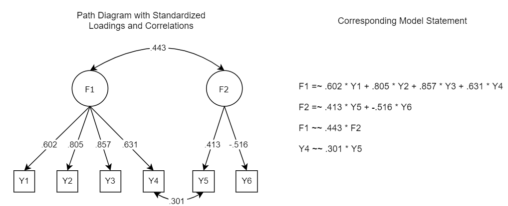

```{r setup, include=FALSE}
knitr::opts_chunk$set(echo = FALSE)
library(rmarkdown)
library(lavaan)
library(tidyverse)
library(simstandard)
library(shiny)
library(shinythemes)
library(flexdashboard)
library(knitr)
library(tools)
#library(patchwork)
library(shinybusy)
library(lemon)
#library(shinycssloaders)

#List aesthetics first
```

<style type="text/css">

body {
  font-family: Palatino;
}

</style>

<!-- Global site tag (gtag.js) - Google Analytics -->
<script async src="https://www.googletagmanager.com/gtag/js?id=UA-167733193-2"></script>
<script>
  window.dataLayer = window.dataLayer || [];
  function gtag(){dataLayer.push(arguments);}
  gtag('js', new Date());

  gtag('config', 'UA-167733193-2');
</script>

```{r design}
fluidPage(theme = shinytheme("slate"),
          shinybusy::add_busy_bar(color = "#BECEE4"))

options(shiny.sanitize.errors = FALSE)
```

Sidebar {.sidebar}
=====================================

This app uses Monte Carlo simulations to generate dynamic model fit index cutoff values for factor models.

\  

```{r inputs}
numericInput("sampsize", "Input Sample Size", value=NULL)

fileInput("model_syntax", "Input Model Syntax",
          placeholder = ".txt file",
          accept = c("text",
                     ".txt",
                     "txt"))

helpText("This may take a few minutes.
         Please only press submit once.")

actionButton("go", "Submit")
```

```{r rename}
#Name inputs
n <- eventReactive(input$go,{input$sampsize})
model <- eventReactive(input$go,{input$model_syntax})
```

```{r number_factor}
#### Function for Number of Factors ####

number_factor <- function(model){
  
  #read in the model
  Mod <- utils::read.delim(model()$datapath, header = FALSE)   
  Mod_C <- base::as.character(Mod$V1)
  
  #prep the model
  lav_file <- lavaan::lavaanify(Mod_C, fixed.x=FALSE) %>%   
    dplyr::filter(.data$lhs != .data$rhs)                  
  
  #isolate factors
  factors <- lav_file %>%                    
    dplyr::filter(op=="=~") %>%            
    dplyr::select(lhs) %>%                 
    base::unique()                   
  
  #identify number of factors in model
  num_factors <- base::nrow(factors)      
  
  return(num_factors)
}
```

```{r unstandardized}
#Did they enter unstandardized loadings?  Aka, do they have any loadings = 1?
unstandardized <- function(model){
  Mod <- utils::read.delim(model()$datapath, header = FALSE)   
  Mod_C <- base::as.character(Mod$V1)             
  
  lav_file <- lavaan::lavaanify(Mod_C, fixed.x=FALSE) %>%  
    dplyr::filter(.data$lhs != .data$rhs)                  
  
  one_plus <- lav_file %>% 
    dplyr::filter(ustart >= 1) %>% 
    base::nrow()
  
  return(one_plus)
}

```

```{r single_factor}
#### Function for Single Factor Misspecification (Correlation) ####

single_factor <- function(model){
  
  #Read in model in text file
  Mod <- utils::read.delim(model()$datapath, header = FALSE)   
  
  #Convert to character for manipulation
  Mod_C <- base::as.character(Mod$V1)                             
  
  #Lavaanify it - have lavaan tell us the parameters
  lav_file <- lavaan::lavaanify(Mod_C, fixed.x=FALSE) %>%   
    dplyr::filter(.data$lhs != .data$rhs)    
  
  #identify the factor name
  factors <- lav_file %>%                    
    dplyr::filter(op=="=~") %>%            
    dplyr::select(lhs) %>%                 
    base::unique()                        
  
  #Identify any items that already have an error covariance
  items_covariance <- factors %>% 
    dplyr::mutate(type="Factor") %>%            
    dplyr::full_join(lav_file, by = "lhs") %>%              
    dplyr::select(-type,type) %>%               
    dplyr::select(lhs,op,rhs,type) %>%          
    dplyr::filter(op=="=~" | is.na(type)) %>%   
    dplyr::filter(is.na(type)) %>%              
    dplyr::select(-type) %>%                    
    tidyr::pivot_longer(-op,names_to = "test", values_to = "rhs") %>%  
    dplyr::select(-op,-test) %>%               
    dplyr::mutate(lhs=NA,op=NA,ustart=NA)      
  
  #Isolate the items that do not already have an error covariance
  solo_items <- lav_file %>% 
    dplyr::select(lhs,op,rhs,ustart) %>%    
    base::rbind(items_covariance) %>%      
    dplyr::filter(op=="=~"|is.na(op)) %>%   
    dplyr::group_by(rhs) %>%                
    dplyr::add_tally() %>%                  
    dplyr::filter(n==1) %>%                 
    dplyr::ungroup() 
  
  #Select the item with the lowest loading
  lowest1 <- solo_items %>% 
    dplyr::arrange(abs(ustart)) %>% 
    dplyr::slice(1)
  
  #Select the item with the second lowest loading
  lowest2 <- solo_items %>% 
    dplyr::arrange(abs(ustart)) %>% 
    dplyr::slice(2) %>% 
    `colnames<-`(c("lhs2","op2","rhs2","ustart2","n2"))
  
  #Compute the model implied residual correlation (simstandard)
  U1 <- lowest1$ustart
  U2 <- lowest2$ustart2
  Cor <- U1*U2
  #U1E <- (1-(U1^2))              #for dg by lavaan
  #U2E <- (1-(U2^2))
  #Cov <- Cor*sqrt(U1E*U2E)
  
  #Create model DF
  Residual_Correlation <- Cor %>%
    base::as.data.frame() %>%
    `colnames<-`("Cor") %>%
    dplyr::mutate(Cor=round(Cor,4)) %>% 
    base::cbind(lowest1,lowest2) %>% 
    dplyr::mutate(operator="~~") %>% 
    dplyr::mutate(times="*") %>% 
    dplyr::select(rhs,operator,Cor,times,rhs2) %>% 
    tidyr::unite("V1",sep=" ")
  
  return(Residual_Correlation)
}
```

```{r multi_factor}
#### Function for multi-factor misspecification (Cross-loading) ####

multi_factor <- function(model){
  
  #Read in model in text file
  Mod <- utils::read.delim(model()$datapath, header = FALSE)   
  
  #Convert to character for manipulation
  Mod_C <- base::as.character(Mod$V1)                             
  
  #Lavaanify it - have lavaan tell us the parameters
  lav_file <- lavaan::lavaanify(Mod_C, fixed.x=FALSE) %>%   
    dplyr::filter(.data$lhs != .data$rhs)    
  
  #identify all factor names
  factors <- lav_file %>%                    
    dplyr::filter(op=="=~") %>%            
    dplyr::select(lhs) %>%                 
    base::unique()
  
  #Compute Coefficient H for each factor
  Coef_H <- lavaan::lavaanify(Mod_C, fixed.x = FALSE) %>% 
    dplyr::filter(lhs != rhs) %>% 
    dplyr::filter(op == "=~") %>% 
    dplyr::mutate(L_Sq=ustart^2) %>% 
    dplyr::mutate(E_Var=1-L_Sq) %>% 
    dplyr::mutate(Div=L_Sq/E_Var) %>% 
    dplyr::group_by(lhs) %>% 
    dplyr::summarise(Sum=sum(Div)) %>% 
    dplyr::mutate(H=((1+(Sum^-1))^-1)) %>% 
    dplyr::select(-Sum) %>% 
    dplyr::arrange(-H) %>% 
    `colnames<-`(c("rhs","H"))
  
  #Identify number of items per factor
  num_items <- lav_file %>% 
    dplyr::filter(op=="=~") %>% 
    dplyr::group_by(lhs) %>% 
    dplyr::count() %>% 
    dplyr::ungroup() %>% 
    base::as.data.frame() %>% 
    `colnames<-`(c("lhs","Original"))
  
  #Identify any items that already have an error covariance
  items_covariance <- factors %>% 
    dplyr::mutate(type="Factor") %>%            
    dplyr::full_join(lav_file, by = "lhs") %>%              
    dplyr::select(-type,type) %>%               
    dplyr::select(lhs,op,rhs,type) %>%          
    dplyr::filter(op=="=~" | is.na(type)) %>%   
    dplyr::filter(is.na(type)) %>%              
    dplyr::select(-type) %>%                    
    tidyr::pivot_longer(-op,names_to = "test", values_to = "rhs") %>%  
    dplyr::select(-op,-test) %>%               
    dplyr::mutate(lhs=NA,op=NA,ustart=NA)      
  
  #Isolate the items that do not already have an error covariance or cross-loading
  solo_items <- lav_file %>% 
    dplyr::select(lhs,op,rhs,ustart) %>%    
    base::rbind(items_covariance) %>%      
    dplyr::filter(op=="=~"|is.na(op)) %>%   
    dplyr::group_by(rhs) %>%                
    dplyr::add_tally() %>%                  
    dplyr::filter(n==1) %>%                 
    dplyr::ungroup() 
  
  #Count number of items remaining per factor
  remaining <- solo_items %>% 
    dplyr::group_by(lhs) %>% 
    dplyr::select(-n) %>% 
    dplyr::count() %>% 
    dplyr::ungroup() %>% 
    base::as.data.frame() %>% 
    `colnames<-`(c("lhs","Remaining"))
  
  #Figure out which items are ideally eligible for cross-loading misspecification
  eligible <- remaining %>% 
    dplyr::full_join(num_items,by="lhs") %>% 
    dplyr::filter(Original>2 & Remaining != "NA") %>% 
    dplyr::mutate(Eligible=1) %>% 
    dplyr::select(lhs,Eligible)
  
  #Compute number that are ideally eligible
  Num_Eligible <- base::nrow(eligible)
  
  #Identify item and factor with lowest loading (that doesn't have an existing error cov)
  #We prefer to select a factor with 3+ items for identification purposes
  #If there is an eligible factor with at least 3 items, pick the lowest loading from one of those
  #If there isn't, then you can still proceed 
  if(Num_Eligible>0){
    crosses <- solo_items %>% 
      dplyr::filter(op=="=~") %>%            
      dplyr::select(lhs,op,rhs,ustart) %>%   
      dplyr::group_by(rhs) %>%                   #this is where we remove
      dplyr::add_tally() %>%                     #any items that load on
      dplyr::filter(n==1) %>%                    #more than one factor
      dplyr::full_join(eligible,by="lhs") %>%    #add factor eligibility status
      dplyr::filter(Eligible == 1) %>%           #select only factors that are eligible
      dplyr::arrange(abs(ustart)) %>%            #choose the lowest loading item
      base::as.data.frame() %>%                  #from a factor with more than 2 items
      dplyr::slice(1) %>%                        
      dplyr::select(-n,-op, -Eligible) %>%              
      dplyr::as_tibble() %>%                 
      `colnames<-`(c("Factor","Item","Loading"))
  } else {
    crosses <- solo_items %>% 
      dplyr::filter(op=="=~") %>%            
      dplyr::select(lhs,op,rhs,ustart) %>%   
      dplyr::group_by(rhs) %>%                   #this is where we remove
      dplyr::add_tally() %>%                     #any items that load on
      dplyr::filter(n==1) %>%                    #more than one factor
      dplyr::arrange(abs(ustart)) %>%            #choose the lowest loading item
      base::as.data.frame() %>%                 #from any factor
      dplyr::slice(1) %>%                        
      dplyr::select(-n,-op) %>%              
      dplyr::as_tibble() %>%                 
      `colnames<-`(c("Factor","Item","Loading"))
  }
  
  #isolate factors and factor correlations
  factcor1 <- factors %>%
    dplyr::mutate(type="Factor") %>% 
    dplyr::full_join(lav_file, by = "lhs") %>% 
    dplyr::mutate(type=recode(type, .missing ="Error Correlation")) %>% 
    dplyr::select(lhs,op,rhs,ustart,type) %>% 
    dplyr::filter(op=="~~" & type=="Factor")
  
  #flip in reverse so we get a list of all factors in one column
  factcor2 <- factors %>%
    dplyr::mutate(type="Factor") %>% 
    dplyr::full_join(lav_file, by = "lhs") %>% 
    dplyr::select(lhs,op,rhs,ustart,type) %>% 
    dplyr::filter(op=="~~" & type=="Factor") %>% 
    `colnames<-`(c("rhs","op","lhs","ustart","type")) %>% 
    dplyr::select(lhs,op,rhs,ustart,type)
  
  #combine and clean
  modinfo <- factcor1 %>% 
    dplyr::full_join(factcor2, by = c("lhs", "op", "rhs", "ustart", "type")) %>% 
    base::cbind(crosses) %>% 
    dplyr::full_join(Coef_H,by="rhs") %>% 
    dplyr::filter(lhs == Factor) %>% 
    dplyr::arrange(-H) %>% 
    dplyr::slice(1) %>% 
    dplyr::mutate(operator="=~")
  
  #Compute maximum allowable cross loading value
  F1 <- modinfo$ustart
  F1_Sq <- F1^2                       #.95 = monte carlo correction
  L1 <- modinfo$Loading               #to ensure that the dgm matrix
  L1_Sq <- L1^2                       #is positive definite
  E <- 1-L1_Sq
  MaxAllow <- ((sqrt((L1_Sq*F1_Sq)+E)-(L1*F1))*.95)
  
  #extract value of loading
  Final_Loading <- round(min(L1,MaxAllow),4)
  
  #Create model DF
  Cross_Loading <- modinfo %>% 
    dplyr::select(rhs,Item,operator) %>% 
    base::cbind(Final_Loading) %>% 
    dplyr::mutate(times="*") %>% 
    dplyr::select(rhs,operator,Final_Loading,times,Item) %>% 
    tidyr::unite("V1",sep=" ")
  
  #return value to append to model statement
  return(Cross_Loading)
}
```

```{r misspecified_dgm}
#### Function to create Misspecified DGM given the number of factors ####

Misspecified_DGM <- function(model){
  
  factor <- number_factor(model()$datapath)
  mod <- utils::read.delim(model()$datapath,header=FALSE)

  if (factor > 1){
    multi <- multi_factor(model()$datapath)
    multi_mod <- base::rbind(mod,multi)
    multi_mod_c <- multi_mod$V1
    return(multi_mod_c)
    
  } else{
    single <- single_factor(model()$datapath)
    single_mod <- base::rbind(mod,single)
    single_mod_c <- single_mod$V1
    return(single_mod_c)
  }
  
}
```

```{r true_dgm}
#### Function to create True DGM (aka, just the model the user read in) ####

True_DGM <- function(model){
  
  Mod <- utils::read.delim(model()$datapath, header = FALSE)   
  Mod_C <- base::as.character(Mod$V1)              
  
  return(Mod_C)
}
```

```{r cleanmodel}
#### Function to create model statement without numbers from user model (for input) ####

cleanmodel <- function(model){
  
  Mod <- utils::read.delim(model()$datapath, header = FALSE)   
  Mod_C <- base::as.character(Mod$V1)
  
  Mod_C %>%
    lavaan::lavaanify(fixed.x = FALSE) %>%
    dplyr::filter(.data$lhs != .data$rhs) %>%
    dplyr::group_by(.data$lhs, .data$op) %>%
    dplyr::summarise(rhs = paste(.data$rhs, collapse = " + ")) %>%
    dplyr::arrange(dplyr::desc(.data$op)) %>%
    tidyr::unite("l", .data$lhs, .data$op, .data$rhs, sep = " ") %>%
    dplyr::pull(.data$l) 
  
}
```

```{r misspecified_model_fit}
#Simulate misspecified data fit stats

misspecified_model_fit <- function(model,n){
  
  #Get clean model equation
  mod <- cleanmodel(model()$datapath)
  
  #Get parameters for misspecified dgm
  misspec_dgm <- Misspecified_DGM(model()$datapath)
  
  #Create empty df to put fit stats in
  misspec_fit <- data.frame(matrix(nrow=500,ncol=3))
  
  #Use max sample size of 10000
  n <- min(n(),10000)
  
  #Simulate data through loop 500 times
  set.seed(649364)
  for (i in 1:500){                                           
    misspec_data <- simstandard::sim_standardized(m=misspec_dgm,n = n,
                                               latent = FALSE,
                                               errors = FALSE)
    misspec_cfa <- lavaan::cfa(model = mod, data = misspec_data, std.lv=TRUE)
    misspec_fits <- lavaan::fitMeasures(misspec_cfa, c("srmr","rmsea","cfi"))
    misspec_fit[i,] <- misspec_fits
  }
  set.seed(NULL)
  
  #Clean up data
  misspec_fit_sum <- misspec_fit %>%
    `colnames<-`(c("SRMR_M","RMSEA_M","CFI_M")) %>% 
    dplyr::mutate(Type_M="Misspecified")
  
  return(misspec_fit_sum)
  
}
```

```{r true_model_fit}
#Simulate true data fit stats

true_model_fit <- function(model,n){
  
  #Get clean model equation
  mod <- cleanmodel(model()$datapath)
  
  #Get parameters for true dgm
  true_dgm <- True_DGM(model()$datapath)
  
  #Create empty df to put fit stats in
  true_fit <- data.frame(matrix(nrow=500,ncol=3))
  
  #Use max sample size of 10000
  n <- min(n(),10000)
  
  #Simulate data through loop 500 times
  set.seed(326267)
  for (i in 1:500){                                           
    true_data <- simstandard::sim_standardized(m=true_dgm,n = n,
                                               latent = FALSE,
                                               errors = FALSE)
    true_cfa <- lavaan::cfa(model = mod, data = true_data, std.lv=TRUE)
    true_fits <- lavaan::fitMeasures(true_cfa, c("srmr","rmsea","cfi"))
    true_fit[i,] <- true_fits
  }
  set.seed(NULL)
  
  #Clean up data
  true_fit_sum <- true_fit %>%
    `colnames<-`(c("SRMR_T","RMSEA_T","CFI_T")) %>% 
    dplyr::mutate(Type_T="True")
  
  return(true_fit_sum)
  
}
```

```{r dynamic_fit}
#Combine into one dataframe
dynamic_fit <- eventReactive(input$go,{
  
  #Use max sample size of 10000
  n <- min(n(),10000)
  
  #Get fit stats for misspecified model
  misspec_fit <- misspecified_model_fit(model()$datapath,n)
  
  #Get fit stats for correctly specified model
  true_fit <- true_model_fit(model()$datapath,n)
  
  #ifelse statements to produce final table
  Table <- base::cbind(misspec_fit,true_fit)

  #Final table
  Table
  
})

```


Single Level CFA
=====================================  

Row {.tabset}
-----------------------------------------------------------------------


### Instructions

**To generate dynamic model fit index cutoffs:**

1. Input your sample size
1. Write your model statement in a **text** file (.txt).
1. For the  model statement, enter your model's **standardized** factor loadings, factor correlations (if any), and residual correlations (if any).
   - Factor loadings are denoted by = ~
   - Correlations are denoted by ~ ~
   - Enter the magnitude of the relationship first
1. **Important**: Make sure to press enter at the end of the last line of the model statement before saving the text file.  
1. Upload the text file with the model statement and press submit.
1. When the simulations are complete, the results will appear in the **Results** and **Plots** tabs.

**Example:**

<div>
```{r instructions, out.width="75%"}

```
</div>

**Note**: These cutoff values are currently only accurate for single level cfa models.  Any cutoff values produced for bi-factor models or higher-order models are inaccurate (you will likely get an error message if you try to compute them).

<div>
```{r progress1}
#Just added because of a shiny bug with the action button
#Ignore

renderTable({
  
  invisible(dynamic_fit() %>% 
    filter(SRMR_T==0))
  
}, colnames = FALSE, striped = FALSE)
```
</div>

### Results

These are the dynamic model fit index cutoff values for your model:

<div>
```{r fit-table}
#Generate dynamic model fit index cutoffs and table
renderTable({
  
  shiny::validate(
          shiny::need(tools::file_ext(model()$name) %in% 
                 c('text','.txt','txt'),
               "You must enter a text file (.txt)"))

  shiny::validate(
    shiny::need(unstandardized(model()$datapath)==0,
    "One of your loadings or correlations has a value of 1 or above (an impossible value). You must use standardized loadings."))
    
  misspec_sum <- dynamic_fit() %>%  
    dplyr::summarise(SRMR_M=quantile(SRMR_M, c(.05,.1)),
                     RMSEA_M=quantile(RMSEA_M, c(.05,.1)),
                     CFI_M=quantile(CFI_M, c(.95,.9)))
  
  true_sum <- dynamic_fit() %>% 
    dplyr::summarise(SRMR_T=quantile(SRMR_T, c(.95,.9)),
                     RMSEA_T=quantile(RMSEA_T, c(.95,.9)),
                     CFI_T=quantile(CFI_T, c(.05,.1)))
  
  Table <- cbind(misspec_sum,true_sum) %>% 
    dplyr::mutate(SRMR_R=base::round(SRMR_M,3),
           RMSEA_R=base::round(RMSEA_M,3),
           CFI_R=base::round(CFI_M,3),
           SRMR=base::ifelse(SRMR_T<SRMR_M,SRMR_R,"NONE"),
           RMSEA=base::ifelse(RMSEA_T<RMSEA_M,RMSEA_R,"NONE"),
           CFI=base::ifelse(CFI_T>CFI_M,CFI_R,"NONE")) %>%
    dplyr::select(SRMR,RMSEA,CFI)
  
  T_R1 <- Table %>% 
    dplyr::slice(1) %>% 
    dplyr::rename(SRMR_1=SRMR,
           RMSEA_1=RMSEA,
           CFI_1=CFI)
  
  T_R2 <- Table%>% 
    dplyr::slice(2) %>% 
    dplyr::rename(SRMR_2=SRMR,
           RMSEA_2=RMSEA,
           CFI_2=CFI)
  
  T_C <- cbind(T_R1,T_R2) %>% 
    dplyr::mutate(SRMR=base::ifelse(base::is.character(SRMR_1),SRMR_2,"--"),
           RMSEA=base::ifelse(base::is.character(RMSEA_1),RMSEA_2,"--"),
           CFI=base::ifelse(base::is.character(CFI_1),CFI_2,"--")) %>% 
    dplyr::select(SRMR,RMSEA,CFI)
  
  Table_Final <- Table %>% 
    dplyr::slice(1) %>% 
    base::rbind(T_C) %>% 
    dplyr::mutate(Cut=c("95/5","90/10")) %>% 
    dplyr::select(Cut,SRMR,RMSEA,CFI) %>% 
    column_to_rownames(var="Cut")},
    digits=3, align='c', rownames = TRUE, width="auto",
    bordered = TRUE) 
```
</div>

\  

- The first row of the table represents the ideal cutoff values.  At this cutoff value, 95% of misspecified models will be correctly rejected, while only 5% of correctly specified models will be incorrectly rejected.  This value is best equipped to distinguish between a well-fitting and misspecified model.

- The second row of the table represents acceptable cutoff values.  At this cutoff value, 90% of misspecified models will be correctly rejected, while 10% of correctly specified models will be incorrectly rejected.  If the first row says NONE, you should use this value instead.  *This row will be blank if ideal cutoff values are available*.

- If you see the word NONE in both rows, that means that there are no dynamic model fit index cutoff values for that fit index that will correctly reject a misspecified model 90% of the time while also correctly failing to reject a correctly specified model at least 10% of the time. Thus, this fit index cannot distinguish between well-fitting models and ill-fitting models for your model.

### Plots

A comparison of the fit index distributions for the "true" empirical model and the "misspecified" empirical model.  The dashed line represents the ideal dynamic model fit cutoff value for the user's empirical model.  The dotted line represents the commonly used cutoff values recommended by Hu & Bentler (1999).

<div>
```{r fit-plot}
#Generate corresponding distributions of fit indices for each model
renderPlot({
  
  shiny::validate(
    shiny::need(tools::file_ext(model()$name) %in% 
                 c('text','.txt','txt'),
               "You must enter a text file (.txt)"))

  shiny::validate(
    shiny::need(unstandardized(model()$datapath)==0,
    "One of your loadings or correlations has a value of 1 or above (an impossible
    value). You must use standardized loadings."))
  
  Misspec_dat <- dynamic_fit() %>% 
    dplyr::select(SRMR_M:Type_M) %>% 
    `colnames<-`(c("SRMR","RMSEA","CFI","Model")) 

  True_dat <- dynamic_fit() %>% 
    dplyr::select(SRMR_T:Type_T) %>% 
    `colnames<-`(c("SRMR","RMSEA","CFI","Model"))
  
  misspec_sum <- dynamic_fit() %>%  
    dplyr::summarise(SRMR_M=quantile(SRMR_M, c(.05,.1)),
                     RMSEA_M=quantile(RMSEA_M, c(.05,.1)),
                     CFI_M=quantile(CFI_M, c(.95,.9)))

  true_sum <- dynamic_fit() %>% 
    dplyr::summarise(SRMR_T=quantile(SRMR_T, c(.95,.9)),
                     RMSEA_T=quantile(RMSEA_T, c(.95,.9)),
                     CFI_T=quantile(CFI_T, c(.05,.1)))
  
  plot <- base::rbind(Misspec_dat,True_dat)
  
  SRMR_plot <- plot %>% 
    ggplot(aes(x=SRMR,fill=Model))+ 
    geom_histogram(position="identity",
                   alpha=.5)+
    scale_fill_manual(values=c("#E9798C","#66C2F5"))+
    geom_vline(aes(xintercept=misspec_sum$SRMR_M[1],
               linetype="misspec_sum$SRMR_M[1]",color="misspec_sum$SRMR_M[1]"),
               size=.6)+
    geom_vline(aes(xintercept=.08,
               linetype=".08",color=".08"),
               size=.75)+
    scale_color_manual(name="Cutoff Values",
                       labels=c("Hu & Benter Cutoff","Dynamic Cutoff"),
                       values=c("misspec_sum$SRMR_M[1]"="black",
                                ".08"="black"))+
    scale_linetype_manual(name="Cutoff Values", 
                          labels=c("Hu & Benter Cutoff","Dynamic Cutoff"),
                          values=c("misspec_sum$SRMR_M[1]"="longdash",
                                   ".08"="dotted"))+
    theme(axis.title.y = element_blank(),
          axis.text.y = element_blank(),
          axis.ticks.y = element_blank(),
          panel.background = element_blank(),
          axis.line = element_line(color="black"),
          legend.position = "none",
          legend.title = element_blank(),
          legend.box = "vertical")
  
  RMSEA_plot <- plot %>% 
    ggplot(aes(x=RMSEA,fill=Model))+ 
    geom_histogram(position="identity",
                   alpha=.5)+
    scale_fill_manual(values=c("#E9798C","#66C2F5"))+
    geom_vline(aes(xintercept=misspec_sum$RMSEA_M[1],
               linetype="misspec_sum$RMSEA_M[1]",color="misspec_sum$RMSEA_M[1]"),
               size=.6)+
    geom_vline(aes(xintercept=.06,
               linetype=".06",color=".06"),
               size=.75)+
    scale_color_manual(name="Cutoff Values",
                       labels=c("Hu & Benter Cutoff","Dynamic Cutoff"),
                       values=c("misspec_sum$RMSEA_M[1]"="black",
                                ".06"="black"))+
    scale_linetype_manual(name="Cutoff Values", 
                          labels=c("Hu & Benter Cutoff","Dynamic Cutoff"),
                          values=c("misspec_sum$RMSEA_M[1]"="longdash",
                                   ".06"="dotted"))+
    theme(axis.title.y = element_blank(),
          axis.text.y = element_blank(),
          axis.ticks.y = element_blank(),
          panel.background = element_blank(),
          axis.line = element_line(color="black"),
          legend.position = "none",
          legend.title = element_blank(),
          legend.box = "vertical")
  
  CFI_plot <- plot %>% 
    ggplot(aes(x=CFI,fill=Model))+ 
    geom_histogram(position="identity",
                   alpha=.5)+
    scale_fill_manual(values=c("#E9798C","#66C2F5"))+
    geom_vline(aes(xintercept=misspec_sum$CFI_M[1],
               linetype="misspec_sum$CFI_M[1]",color="misspec_sum$CFI_M[1]"),
               size=.6)+
    geom_vline(aes(xintercept=.95,
               linetype=".95",color=".95"),
               size=.75)+
    scale_color_manual(name="Cutoff Values",
                       labels=c("Hu & Benter Cutoff","Dynamic Cutoff"),
                       values=c("misspec_sum$CFI_M[1]"="black",
                                ".95"="black"))+
    scale_linetype_manual(name="Cutoff Values", 
                          labels=c("Hu & Benter Cutoff","Dynamic Cutoff"),
                          values=c("misspec_sum$CFI_M[1]"="longdash",
                                   ".95"="dotted"))+
    theme(axis.title.y = element_blank(),
          axis.text.y = element_blank(),
          axis.ticks.y = element_blank(),
          panel.background = element_blank(),
          axis.line = element_line(color="black"),
          legend.position = "none",
          legend.title = element_blank(),
          legend.box = "vertical")
  
  lemon::grid_arrange_shared_legend(SRMR_plot, RMSEA_plot, CFI_plot,
                                    ncol=3,nrow=1)
  
}, width=900,height = 325)

```
</div>

### References

To cite the ideas behind dynamic model fit index cutoff values:

- [McNeish, D.](https://sites.google.com/site/danielmmcneish/home) & [Wolf, M. G.](https://www.melissagwolf.com/) (2020). Dynamic Model Fit. Etc.

To cite the dynamic model fit index cutoff values generated by this app:

- [Wolf, M. G.](https://www.melissagwolf.com/) & [McNeish, D.](https://sites.google.com/site/danielmmcneish/home) (2020). Dynamic Model Fit. R Shiny application version 1.0.0.

\  

To learn more about why you should use dynamic model fit index cutoffs instead of [Hu & Bentler's (1999)](https://psycnet.apa.org/record/1998-03102-001) fixed model fit index cutoff values, consider these articles:

- Greiff, S., & Heene, M. [(2017)](https://doi.org/10.1027/1015-5759/a000450). Why psychological assessment needs to start worrying about model fit [Editorial]. *European Journal of Psychological Assessment, 33*(5), 313–317. 
  - [Easy Access](https://www.researchgate.net/publication/320466182_Why_Psychological_Assessment_Needs_to_Start_Worrying_About_Model_Fit)
- Hancock, G. R., & Mueller, R. O. [(2011)](https://doi.org/10.1177/0013164410384856). The reliability paradox in assessing structural relations within covariance structure models. *Educational and Psychological Measurement, 71*(2), 306–324.
  - [Easy Access](https://pdfs.semanticscholar.org/53d6/c1690265df617dd33ebc94cdc76fbf97777d.pdf)
- Heene, M., Hilbert, S., Draxler, C., Ziegler, M., & Bühner, M. [(2011)](https://doi.org/10.1037/a0024917). Masking misfit in confirmatory factor analysis by increasing unique variances: A cautionary note on the usefulness of cutoff values of fit indices. *Psychological Methods, 16*(3), 319–336. 
  - [Easy Access](https://www.academia.edu/15139444/Masking_misfit_in_confirmatory_factor_analysis_by_increasing_unique_variances_A_cautionary_note_on_the_usefulness_of_cutoff_values_of_fit_indices)
- Marsh, H. W., Hau, K. T., & Wen, Z. [(2004)](https://www.tandfonline.com/doi/abs/10.1207/s15328007sem1103_2). In Search of Golden Rules: Comment on Hypothesis-Testing Approaches to Setting Cutoff Values for Fit Indexes and Dangers in Overgeneralizing Hu and Bentler's (1999) Findings. *Structural Equation Modeling: A Multidisciplinary Journal, 11*(3), 320-341.
  - [Easy Access](https://www.researchgate.net/publication/289963902_In_Search_of_Golden_Rules_Comment_on_Hypothesis-Testing_Approaches_to_Setting_Cutoff_Values_for_Fit_Indexes_and_Dangers_in_Overgeneralizing_Hu_and_Bentler's_1999_Findings)
- McNeish, D., An, J. & Hancock, G. R. [(2018)](https://www.tandfonline.com/doi/abs/10.1080/00223891.2017.1281286). The Thorny Relation Between Measurement Quality and Fit Index Cutoffs in Latent Variable Models, *Journal of Personality Assessment, 100*(1), 43-52.
  - [Easy Access](https://www.researchgate.net/publication/311536084_The_Thorny_Relation_between_Measurement_Quality_and_Fit_Index_Cut-Offs_in_Latent_Variable_Models)

\  

Computationally, this app relies on the following packages:

- [lavaan](http://www.jstatsoft.org/v48/i02/). Rosseel, Y. (2012). lavaan: An R Package for Structural Equation Modeling. Journal of Statistical Software, 48(2), 1-36.
- [simstandard](https://CRAN.R-project.org/package=simstandard). Schneider, W. J. (2019). simstandard: Generate Standardized Data. R package version 0.3.0. 
- [tidyverse](https://doi.org/10.21105/joss.01686). Wickham et al., (2019). Welcome to the tidyverse. Journal of Open Source Software, 4(43), 1686.

Aesthetically, this app relies on the following packages:

- [shiny](https://CRAN.R-project.org/package=shiny). Chang, W., Cheng, J., Allaire, J., Xie, Y., & McPherson, J. (2020). shiny: Web Application Framework for R. R package version 1.4.0.2.
- [flexdashboard](https://CRAN.R-project.org/package=flexdashboard). Iannone, R., Allaire, J., & Borges, B. (2018). flexdashboard: R
  Markdown Format for Flexible Dashboards. R package version 0.5.1.1.
- [shinythemes](https://CRAN.R-project.org/package=shinythemes). Winston Chang (2018). shinythemes: Themes for Shiny. R package version 1.1.2.
- [shinybusy](https://CRAN.R-project.org/package=shinybusy). Meyer, F. & Perrier, V. (2019). shinybusy: Busy Indicator for 'Shiny' Applications. R package version 0.2.0. 
- [lemon](https://CRAN.R-project.org/package=lemon). Edwards, S. M. (2020). lemon: Freshing Up your 'ggplot2' Plots. R package version 0.4.4. 
- [knitr](https://yihui.org/knitr/). Xie, Y. (2020). knitr: A General-Purpose Package for Dynamic Report Generation in R. R package version 1.28.

This app began as a project in a graduate course taught by [Allison Horst](https://www.allisonhorst.com/).

<div>
```{r progress2}
#Just added because of a shiny bug with the action button
#Ignore

renderPlot({
  
  invisible(dynamic_fit() %>% 
    filter(SRMR_T==0))
  
}, width=1,height=1)
```
</div>
